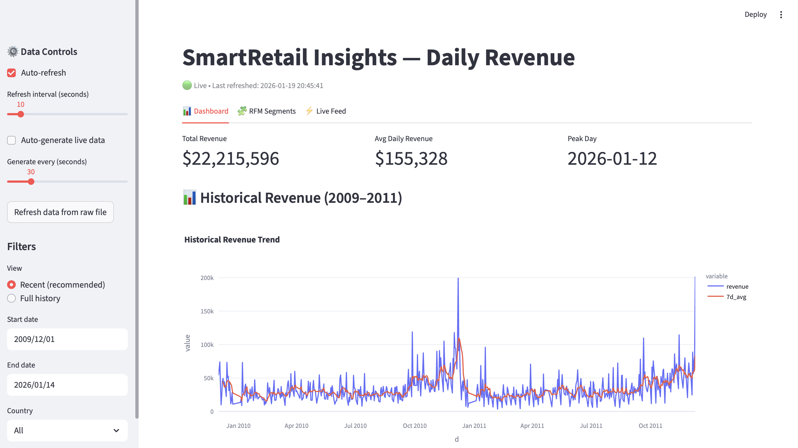
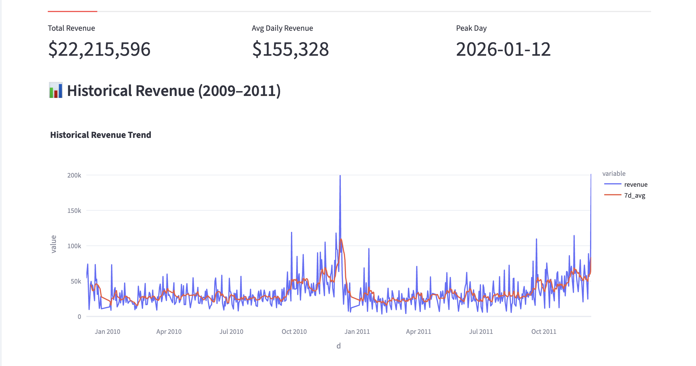
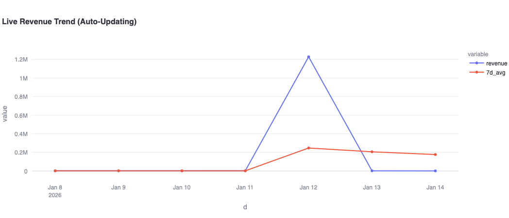
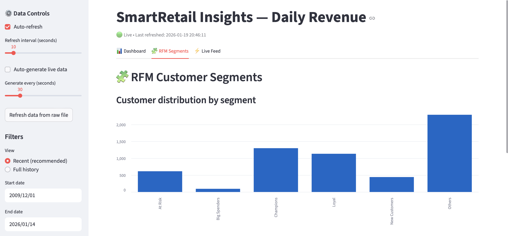
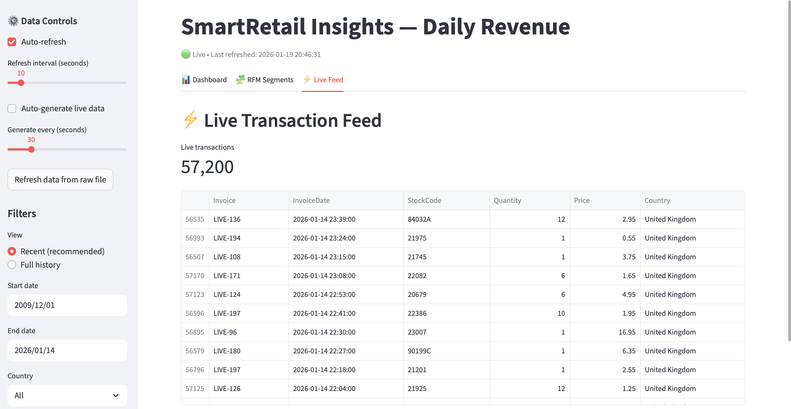

# 🛍️ SmartRetail Insights

### Real-Time Retail Analytics Dashboard (Python · Streamlit · Pandas · Parquet)

SmartRetail Insights is an **end-to-end retail analytics project** built on the **Online Retail II dataset**, demonstrating how raw transactional data can be transformed into **analytics-ready datasets** and surfaced through an **interactive, auto-refreshing dashboard**.

The project simulates a **real-world analytics workflow**:
**raw data → ETL → Parquet analytics tables → KPIs, trends, customer insights → live monitoring**.

---

## 🚀 What This Project Demonstrates

This project was designed to mirror how analytics systems are built and used in production environments.

### ✅ Core Analytics Skills

* Data cleaning and validation on transactional datasets
* Time-series aggregation and revenue analysis
* Customer analytics using **RFM (Recency, Frequency, Monetary)** modeling
* KPI definition aligned to business metrics

### ✅ Engineering & Workflow Skills

* Reproducible ETL pipelines using Python
* Analytics-optimized storage using **Parquet**
* Incremental data ingestion (simulated “live” transactions)
* Auto-refresh dashboard pattern for monitoring use cases

### ✅ Business Thinking

* Revenue trends and moving averages for decision-making
* Customer segmentation to support retention and targeting strategies
* “Live” monitoring views for operational awareness

---

## 📊 Key Features

### 📌 Dashboard (Streamlit)

* **KPI cards**:

  * Total Revenue
  * Average Daily Revenue
  * Peak Revenue Day
* **Historical Revenue Trend (2009–2011)** with 7-day moving average
* **Live Revenue Trend (Last 7 Days)** designed for monitoring
* **Top countries by revenue**
* Interactive filters (date range, country, view mode)

---

### ⚡ Simulated Real-Time Analytics

* Incremental “live transactions” are generated and appended to a Parquet store
* Aggregated tables and KPIs update automatically
* Auto-refresh controls allow the dashboard to behave like a live system
* Designed to demonstrate **near-real-time analytics patterns** without external streaming tools

---

### 🧩 Customer Analytics (RFM Segmentation)

* Customer-level RFM scoring:

  * **Recency** – how recently a customer purchased
  * **Frequency** – how often they purchase
  * **Monetary** – how much they spend
* Customers grouped into business-friendly segments:

  * Champions
  * Loyal
  * Big Spenders
  * At Risk
  * New Customers
* Segment distribution visualizations and insights

---

## 🗂️ Project Structure

```text
smartretail-insights/
├── streamlit_app/
│   └── app.py                      # Streamlit dashboard (KPIs, charts, tabs)
├── src/
│   ├── convert_online_retail.py     # ETL: raw → Parquet analytics tables
│   ├── simulate_transactions.py     # Simulated live ingestion (incremental data)
│   └── rfm_segmentation.py          # Customer RFM segmentation logic
├── data/
│   ├── raw/                         # Raw dataset (not committed)
│   └── processed/                   # Parquet outputs (not committed)
├── assets/                          # Dashboard screenshots for README
├── requirements.txt
└── README.md
```

---

## 📸 Dashboard Screenshots

### 🔹 Dashboard Overview



### 🔹 Historical Revenue (2009–2011)



### 🔹 Live Revenue Trend (Last 7 Days)



### 🔹 RFM Customer Segments



### 🔹 Live Transaction Feed



---

## 🛠️ Tech Stack

* **Python** – core data processing and analytics
* **Pandas / NumPy** – data manipulation and aggregation
* **Parquet** – analytics-optimized data storage
* **Streamlit** – interactive dashboard and monitoring UI
* **Plotly** – interactive charts and visualizations

---

## ▶️ How to Run Locally

```bash
# 1. Create virtual environment
python -m venv .venv
source .venv/bin/activate   # macOS/Linux
# .venv\Scripts\activate    # Windows

# 2. Install dependencies
pip install -r requirements.txt

# 3. Run ETL (raw → parquet)
python src/convert_online_retail.py

# 4. (Optional) Generate simulated live data
python src/simulate_transactions.py

# 5. Launch dashboard
streamlit run streamlit_app/app.py
```

---

## 📌 Notes

* Raw data files are intentionally **not committed**
* Parquet outputs are regenerated via scripts
* Live behavior is **simulated** to demonstrate production analytics patterns

---

## 👤 Author

**Ayushi Patel**
Business / Data Analyst
📍 Boston, MA

